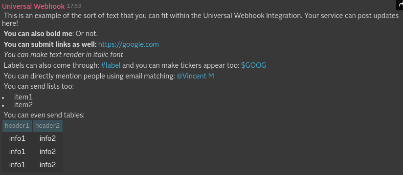

_Note that this project depends on internal Symphony infrastructure (repository.symphony.com), and therefore it can only be built by Symphony LLC employees/partners._

# Universal Webhook Integration
The Universal Webhook Integration enables you to send messages directly from any service into a Symphony conversation of your choice - either a 1:1 IM with you, or a room that you are the owner of.

## How it works
If you have a service that can be configured to send webhooks, all you have to do is point it to the URL you generate in the Universal Webhook Application available on Symphony Market, and setup your service to post webhook payloads to that URL, in messageML format.

## What formats and events it support and what it produces
Every integration will get a message sent in a specific format (depending on what system is it dealing with) and it will usually convert it into an "entity" before it reaches the Symphony platform.
It will also, usually, identify the kind of message it will deal with based on an "event" identifier, that varies based on which system is it integrating with.

The Universal Webhook in the other hand does not support any special events, and it merely forwards the message received (if valid). 
It deals with messages in the `<messageML></messageML>` format only.

The validation it submits the message will enforce the rules presented [here](https://rest-api.symphony.com/docs/message-format/)

Below is an example of:
#### What sort of message you can send through the Universal Webhook Integration
```sh
<messageML>
This is an example of the sort of text that you can fit within the Universal Webhook Integration. Your service can post updates here!
<br />

<b>You can also bold me</b>: Or not.
<br />
 
<b>You can submit links as well: </b>
<a href="https://google.com" />
 
<i> you can also make text render in italic font </i>
<br />Labels can also come through: <hash tag="label"/> and you can make tickers appear too: <cash tag="GOOG"/>
 
You can also directly mention people using email matching: <mention email="vincent@symphony.com"/>
<br />
You can also send lists:
<ul><li>text</li></ul>
 
<br />
You can also send tables:
 
<table><tr><td>text</td></tr></table>
 
</messageML>
```
#### What kind of entity will it generate (exactly the same as above)
```sh
<messageML>
This is an example of the sort of text that you can fit within the Universal Webhook Integration. Your service can post updates here!
<br />

<b>You can also bold me</b>: Or not.
<br />
 
<b>You can submit links as well: </b>
<a href="https://google.com" />
 
<i> you can also make text render in italic font </i>
<br />Labels can also come through: <hash tag="label"/> and you can make tickers appear too: <cash tag="GOOG"/>
 
You can also directly mention people using email matching: <mention email="vincent@symphony.com"/>
<br />
You can also send lists:
<ul><li>text</li></ul>
 
<br />
You can also send tables:
 
<table><tr><td>text</td></tr></table>
 
</messageML>
```
#### What it looks like when rendered in Symphony platform


